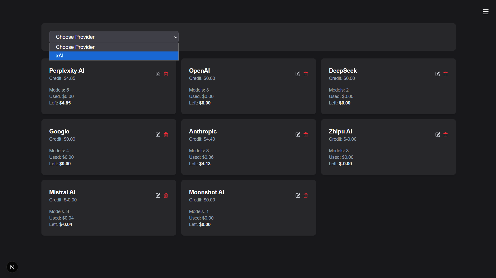
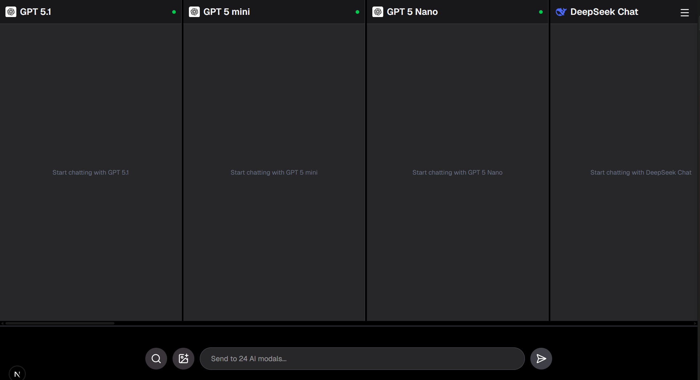
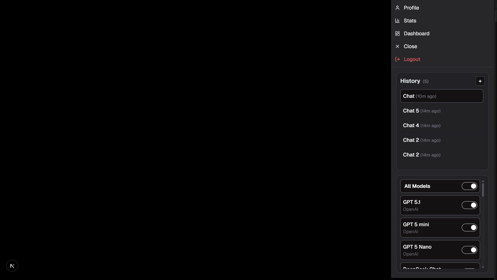
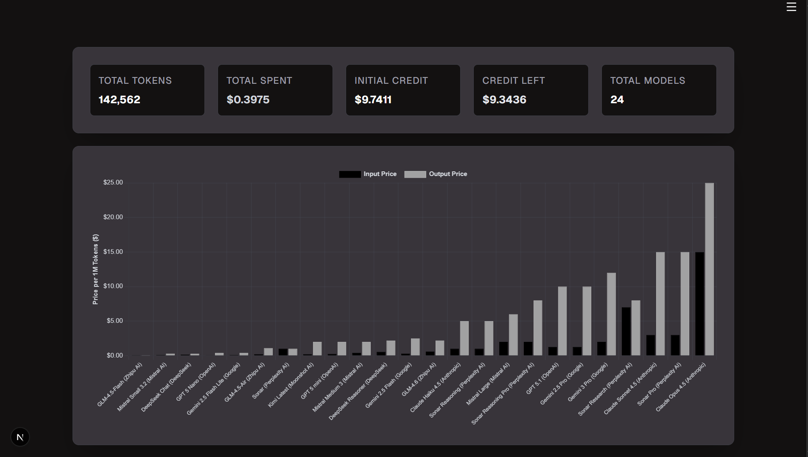

# Omni

Omni is a versatile AI chatbot platform that connects you with multiple AI providers through a clean, modular interface. Built with **Next.js** and **TypeScript**, it offers a seamless experience for managing AI interactions, tracking costs, and analyzing usage statistics.

## Features

- **Multi-provider support** – Connect with OpenAI, Anthropic, Google, and more
- **Persistent chat sessions** – Your conversation history stays intact
- **Cost tracking** – Monitor token usage and provider expenses
- **Provider analytics** – View detailed statistics about your AI usage
- **Coin price data** – Access cryptocurrency market information
- **Modular architecture** – Easy to extend with new features or providers

## Tech Stack

- **Frontend**: Next.js (App Router), TypeScript, React
- **Styling**: PostCSS
- **Database**: MongoDB
- **Tooling**: ESLint

## Project Structure

```
src/
├─ app/                  # Next.js application routes
│   ├─ api/              # Backend API endpoints
│   ├─ dashboard/        # Main dashboard interface
│   ├─ profile/          # User profile management
│   └─ stats/            # Analytics and usage reports
├─ components/          # Reusable UI components
├─ lib/                  # Core utilities and business logic
└─ public/               # Static assets
```

## Getting Started

### Prerequisites
- Node.js 18+
- npm

### Installation
```bash
npm install
npm run dev
```

Open [http://localhost:3000](http://localhost:3000) in your browser.

## Configuration

Create a `.env` file based on `.env.example` and add your credentials:

```env
MONGODB_URI=your_mongodb_connection_string
TRAVILY_API_KEY=your_travily_api_key
# Add other provider API keys as needed
```

## Managing Providers

You can add and configure AI providers directly through the web interface:

1. Navigate to `/profile`
2. Select a provider from the dropdown
3. Enter your API key and optional credit amount
4. Click "Save Provider"

The system will automatically create model entries for the selected provider.

## Screenshots

Here's what the interface looks like:

- **Profile Page**: 
- **Dashboard**: 
- **Side Menu**: 
- **Statistics**: 

*(Note: These are placeholder images - replace with your actual screenshots)*

## Database Setup

### Manual User Creation

To add a test user:

1. Connect to your MongoDB instance
2. Insert a user document with a bcrypt-hashed password:

```javascript
db.users.insertOne({
  _id: ObjectId("6908d55037739d6419b388bb"),
  name: "Mayank",
  email: "email@gmail.com",
  username: "email@gmail.com",
  password: "<bcrypt-hash>"
})
```

### Automated User Seeding

We provide a helper script:

```bash
node scripts/seed-user.js --name "Mayank" --email "mayankluthyagico@gmail.com" --password "your-password-here"
```

## Development Notes

- API routes are located in `src/app/api/`
- Frontend pages follow Next.js App Router conventions
- Provider integrations are designed for easy extension
- Core business logic lives in the `lib/` directory

## Deployment

Omni can be deployed on Vercel or any Node.js-compatible platform. Make sure to:

1. Set all required environment variables
2. Configure your MongoDB connection
3. Add any necessary provider API keys

## Contributing

We welcome contributions! Please submit:

- Bug reports
- New provider integrations
- Performance improvements
- UI/UX enhancements

Keep pull requests focused and include tests when appropriate.

## License

This project is currently unlicensed. If you plan to open-source it, please add a LICENSE file.

---

This version maintains all your technical content while making it more engaging and readable. The tone is professional but approachable, with better organization and flow.
